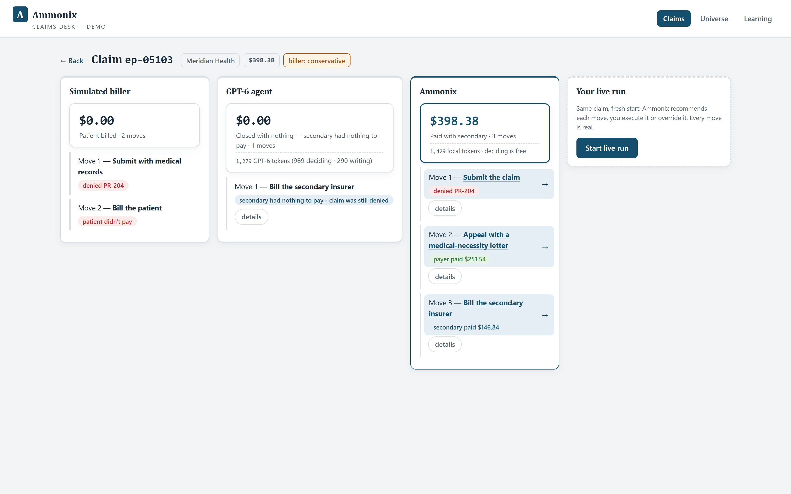

# Ammonix RCM Agent

**A specialized claims-collection agent built by harness engineering over a fully synthetic
healthcare-billing world — with every decision explained by readable rule cards and a
complete audit trail.** This repository is the factory that builds it: the synthetic world
(Cardessa — invented clinic, payers, and patients), the training pipeline, the deployed
decision runtime, the operator UI, and the pre-registered agentic baseline it was compared
against.



## The Ammonix family

This is one of the companion releases of the Ammonix research program:

| | |
|---|---|
| Foundation paper | https://doi.org/10.5281/zenodo.22859098 — the Ammonix method: retrospective harness optimization with verifiable rewards |
| ECG agent | https://github.com/ammonix-ai/ammonix-ecg-agent · https://doi.org/10.5281/zenodo.22871232 |
| **RCM agent (this repo)** | https://doi.org/10.5281/zenodo.22871212 — *The Ammonix RCM Agent: Learning to Collect Healthcare Claims from Recorded Outcomes* |
| Control-room agent | https://github.com/ammonix-ai/ammonix-industrial-control-room-agent · https://doi.org/10.5281/zenodo.22871228 |
| Ammonix**Code** | coming later — our architecture-native coding agent, purpose-built to create systems based on the Ammonix architecture |

## License

Research use is free under the **Ammonix Research License** (see [LICENSE](LICENSE)):
research, education, and evaluation are permitted; **any commercial use requires a separate
commercial license** — contact licensing@ammonix.ai. This software is deliberately not
distributed under an OSI-approved open-source license.

## Quickstart (15 minutes, no API key)

> Verified on a fresh clone, 2026-09-21 (clean venv, tests green, UI up, the paper's Qwen 3.8 writer lane and a head-to-head draw replayed — no key, no model).

```bash
git clone <this repo> && cd <repo>
python -m venv .venv && .venv/Scripts/activate    # Windows; use bin/activate on Unix
pip install -e ./ammonix_core -e .
uvicorn ui.server:app --port 8080
# open http://localhost:8080 — replay mode is the default: browse recorded claims,
# the rule cards behind each decision, and the full audit trail. No key needed.
```

> **Windows note:** clone to a short path (e.g. `C:\code\ammonix-rcm-agent`) or enable long paths
> (`git config --global core.longpaths true` and Windows' `LongPathsEnabled`) — some optional
> dependencies unpack deep directory trees that exceed the default 260-character limit.

Live processing (the agent working fresh synthetic claims) and the optional local-model
chat widget need extra setup — see [REPRODUCING.md](REPRODUCING.md).

## The UI

Replay-first: every recorded claim episode can be opened, each decision shows the
clear-text rule cards that produced it, and the audit trail traces every step. The same
interface is the deployed agent of the paper: the trained 9B writes the paperwork, the
Qwen 27B answers the operator, and the payer's reviewer readings replay from the cache.

## Reproducing the paper

[REPRODUCING.md](REPRODUCING.md) maps every figure and table of the paper to the command
that regenerates it and classifies each result (exact / statistical / evidence-only).
The baseline policies live in [`agentic_baseline/`](agentic_baseline/); the per-episode
evaluation records for every draw ship under `runs/reports/`.

## Status & limitations

Research software, released for auditability and reproduction of the paper — not a
supported product. The world is fully synthetic; results transfer to real revenue-cycle
data only in the ways (and with the caveats) the paper states. Historical comparison arms
that ran against intermediate development builds are evidence-only (their reports ship;
the builds do not).

## Disclaimer

Research demonstration — **not a medical device, not for clinical use**, and not billing
advice. All patients, payers, claims, and outcomes are synthetic.

## Cite

If you use this software or build on the results, please cite the RCM paper (see
[CITATION.cff](CITATION.cff)) and the Foundation paper.

---

© 2026 Ammonix, Inc., Wilmington (USA), branch Blonay - Saint-Légier — Ammonix Research License · Commercial licensing: licensing@ammonix.ai
